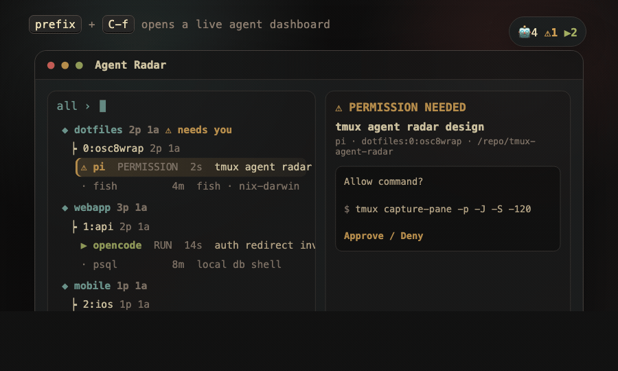

# tmux-agent-radar

A tmux popup dashboard for watching multiple CLI coding agents.

It finds panes running agents like `pi`, `opencode`, `claude`, `codex`, `gemini`, and `cursor-agent`, highlights panes that need permission, previews recent output, and jumps straight to the selected pane.



## Features

- Toggleable tmux popup: `prefix + C-f`
- Agent detection from pane commands and process trees
- Permission-prompt detection from visible pane text
- Recent-output preview before jumping
- Agents-only / all-panes toggle
- Optional status-bar badge: `🤖4 ⚠1 ▶2`
- Optional tmux or macOS notifications for permission prompts

## Requirements

- `tmux`
- `fzf` for the popup UI

## Install

Add the plugin to your tmux config:

```tmux
run-shell ~/projects/tmux-agent-radar/radar.tmux
```

Or with a local TPM-style plugin entry:

```tmux
set -g @plugin '~/projects/tmux-agent-radar'
```

Reload tmux, then open Radar with `prefix + C-f`.

## Status bar

Radar does not edit your status bar automatically. Add the badge wherever you want:

```tmux
set -g status-right "#(~/projects/tmux-agent-radar/bin/tmux-agent-radar status) #[default]#h"
```

## Options

```tmux
# Popup key. Default: prefix + C-f
set -g @agent-radar-key 'C-f'

# Agent command names to detect.
set -g @agent-radar-agents 'pi opencode claude codex gemini aider cursor-agent goose amp qwen'

# Background permission watcher. Default: on
set -g @agent-radar-watch 'on'
set -g @agent-radar-watch-interval '5'

# Notifications. Default: off
set -g @agent-radar-notify 'on'
set -g @agent-radar-notify-macos 'on'

# Popup size.
set -g @agent-radar-popup-width '92%'
set -g @agent-radar-popup-height '88%'
```
