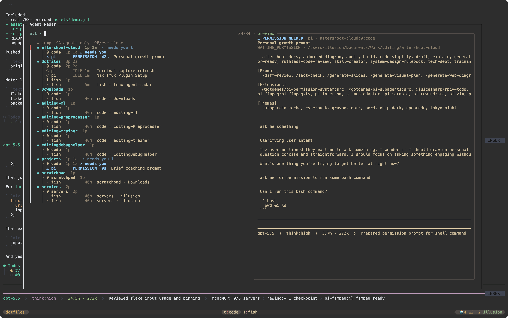

# tmux-agent-radar

A tmux/fzf popup for finding CLI coding-agent panes.

It scans tmux panes for agents like `pi`, `opencode`, `claude`, `codex`, `gemini`, and `cursor-agent`, flags visible permission prompts, previews captured pane output, and jumps to the selected pane.

This is intentionally a passive radar. It does **not** approve, reject, or type into agent prompts from the popup; jump to the pane and answer there.



## Features

- Toggleable tmux/fzf popup: `prefix + C-f`
- Agent detection from pane commands and process trees
- Per-pane activity read from the pane's own tty, so a busy pane no longer makes its quiet
  siblings look busy (tmux's `window_activity` is shared by every pane in a window)
- Five states: `⚠ permission`, `▶ running`, `✓ done`, `○ idle`, `◌ stale` —
  `done` is an agent that was working and has just gone quiet, i.e. your turn
- Permission-prompt detection matched against the last few lines of the screen, so a pane
  that merely *mentions* approving a command is not flagged
- Agents-only / all-panes toggle with `Ctrl-A`
- Remembers the last all-panes / agents-only mode
- All-panes view grouped as a session / window tree, sessions ordered by most recently visited
- Agents-only view is a flat list sorted by status (`⚠ permission` → `▶ running` → `○ idle` → `◌ stale`), most recent activity first
- Jump to the selected pane with `Enter`
- Optional status-bar badge: `🤖4 ⚠1 ▶2 ✓1 ○3`
- Optional tmux or macOS notifications for permission prompts

## Popup controls

- `Enter`: jump to the selected pane
- `Ctrl-A`: toggle agents-only / all-panes
- `Ctrl-R`: rescan now
- `Ctrl-E`: set a label for the selected pane
- `Ctrl-N`: rename the selected pane's window
- `Ctrl-X`: kill the selected pane (asks first)
- `Ctrl-F` or `Esc`: close the popup

Still not supported, by design: approving, denying, or rejecting an agent's prompt. Jump to
the pane and answer there.

## Requirements

- `tmux`
- `fzf` for the popup UI

## Install

Add the plugin to your tmux config:

```tmux
run-shell ~/projects/tmux-agent-radar/radar.tmux
```

Or with a local TPM-style plugin entry:

```tmux
set -g @plugin '~/projects/tmux-agent-radar'
```

Reload tmux, then open Radar with `prefix + C-f`.

## Status bar

Radar does not edit your status bar automatically. Add the badge wherever you want:

```tmux
set -g status-right "#(~/projects/tmux-agent-radar/bin/tmux-agent-radar status) #[default]#h"
```

## Options

```tmux
# Popup key. Default: prefix + C-f
set -g @agent-radar-key 'C-f'

# Agent command names to detect.
set -g @agent-radar-agents 'pi opencode claude codex gemini aider cursor-agent goose amp qwen'

# Background permission watcher. Default: on
set -g @agent-radar-watch 'on'
set -g @agent-radar-watch-interval '5'

# Notifications. Default: off
set -g @agent-radar-notify 'on'
set -g @agent-radar-notify-macos 'on'

# Popup size.
set -g @agent-radar-popup-width '92%'
set -g @agent-radar-popup-height '88%'

# State thresholds, in seconds of pane silence.
# running: still producing output.  done: just went quiet.  idle: quiet a while.
set -g @agent-radar-running-secs '5'
set -g @agent-radar-done-secs '120'
set -g @agent-radar-idle-secs '1800'

# Extra permission-prompt patterns, for an agent Radar does not recognise.
# Appended to the built-in pattern as an alternation, matched case-insensitively
# against the last 15 non-blank lines of the pane.
set -g @agent-radar-prompt-extra 'apply this (change|patch)\?'
```

## Performance

A rescan is one `tmux list-panes`, one `ps`, and one `stat` of every pane tty. Permission
prompts are the only thing needing `capture-pane`, and each verdict is cached against that
tty's mtime — an unchanged screen cannot have changed its answer — so a steady-state
rescan captures nothing and costs ~70ms. The popup reads the cache and opens in ~15ms,
rescanning only when the cache is more than 10 seconds old.
